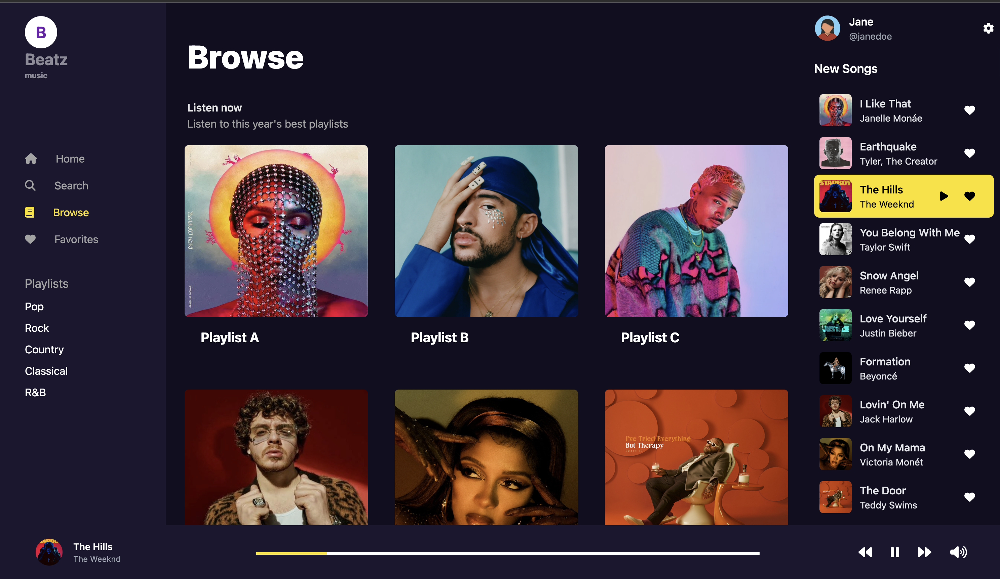

# Beatz Music

Beatz Music is a modern web application designed to connect with an API to stream music. Built with React/Redux, TypeScript, and Tailwind CSS, this app provides an intuitive and responsive user experience for music enthusiasts.

## Features

- Browse music collections and playlists
- Search for songs, artists, and albums
- Listen to your favorite tracks
- Manage and view favorite tracks
- Responsive layout for various devices and screen sizes

## Installation

To get started with Beatz Music, clone the repository to your local machine:

```bash
git clone https://github.com/your-username/beatz-music.git
cd beatz-music
```

To install the necessary dependencies, run the following command in your terminal:

```bash
npm install
```

Run the application in development mode:

```
npm start
```

The app will be available at `http://localhost:3000`.

## Usage

Beatz Music has a straightforward and easy-to-navigate interface. Upon launching the app, you'll be greeted with the homepage which showcases featured music and artists.

### Navigating the App

- **Home** : Discover new music and featured artists.
- **Browse** : Explore curated playlists and genres.
- **Favorites** : Access your saved favorite tracks.
- **Search** : Find music by track, artist, or album.

### Playing Music

To play a song, simply click on the play button next to the track. The audio player at the bottom of the screen will activate, and you can control playback, volume, and track progression.

## Technical Details

### Project Structure

The project is structured as follows:

- `src/pages`: Contains the different pages of the app like HomePage, Browse, Favorites, etc.
- `src/components`: Reusable React components like SearchBar, AudioPlayer, etc.
- `src/types`: TypeScript type definitions used across the app.
- `src/utils`: Utility functions, including API calls.
- `src/store`: Redux store configuration.
- `tailwind.config.js`: Tailwind CSS configuration.

### API Integration

The application makes use of asynchronous API calls to fetch music data. API endpoints are abstracted in the `src/utils/api` directory.

### Redux State Management

State management is handled via Redux, providing a predictable state container for the app.

### TypeScript

TypeScript is used throughout the application to enforce type safety and improve the development experience.

## Contributing

We welcome contributions! Please open an issue or submit a pull request for any features or improvements.

## License

Beatz Music is open-source software licensed under the MIT license.

## Screenshots

### Browse Page



### Homepage


### Playlist Page


### Search Page


